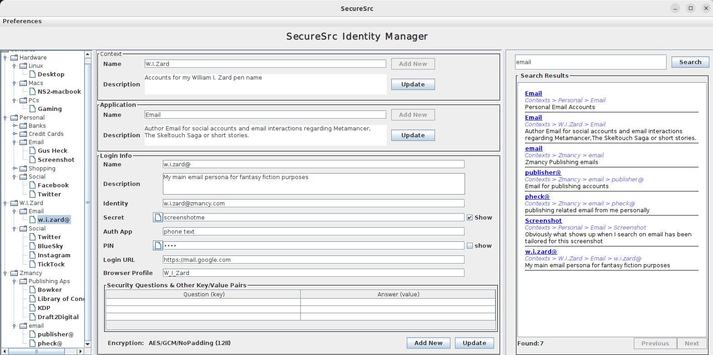

= SecureSrc Identity Manager

ifdef::env-github[]
:imagesdir:
 https://gist.githubusercontent.com/path/to/gist/revision/dir/with/all/images
:tip-caption: :bulb:
:note-caption: :information_source:
:important-caption: :heavy_exclamation_mark:
:caution-caption: :fire:
:warning-caption: :warning:
endif::[]
ifndef::env-github[]
:imagesdir: ./
endif::[]
:toc:
:toc-placement!:

This is an identity management (aka password manager) program that is centered around simplicity and transparency.
One cannot trust code that cannot be understood, and one cannot trust code that is unavailable for inspection.
Therefore, this program endeavors to remain small, open source and clearly focused on exactly one task: encrypting your passwords, and making it easy to find them when you need them.
It's not the prettiest program either, but it's a security app and for our purposes beauty beyond function is bloat. Bloat is the enemy because it can hide tricky code (or bugs).

:toc:[]

IMPORTANT: The author of this software and this page is NOT a security researcher.
What follows is an exposition of motivations and strategies, so that users/reviewers may spot flaws in the thinking and so that users may evaluate for themselves the considerations that went into this software.
The author IS a professional programmer with over 20 years of Java experience, including participating in security discussions for major open source projects.
So while you should question what you read, it is not an entirely uninformed opinion.
It's xref:_how_could_it_fail[unlikely to be perfect], but of course, the hope is it's significantly better than nothing.

NOTE: I wrote this because I wanted it, not for you. I'm sharing it in the hopes that it will help others. For the love God, humanity, yourself or anything else you might cherish, PLEASE read LICENSE.txt before using it. I will try to maintain it from time to time, but am not paid to do so. Pull Requests and issue reports are welcome.

== Circle of Trust

Another key issue in security is the need to trust somebody.
It is entirely intractable for every person who wants to maintain passwords, to write their own password management system.
Not only is it time-consuming and difficult, errors may result in a false sense of security, which in turn causes the user to expose the data to attackers.

NOTE: This project is named SecureSrc because it's intended to be built from source code, minimizing who you have to trust. You should NEVER download a binary version of it from anywhere.

Since we can't all just DIY password management, we need to trust someone to do it for us.
SecureSrc attempts to limit the trusted code to only three parties (NO WARRANTY, see license!).

1. You will be asked to trust the Java vendor of your choice.
This could be Oracle Corporation, Azul Systems, Amazon (Correto) or any other JDK vendor.
Technically, you don't even have to trust their binary distribution and can compile your own copy of OpenJDK.
Before you do however, please note that in doing so you place absolute faith in a MYRIAD of native libraries currently installed on your machine.
JDK vendors are multi-million or multi-billion dollar corporations, and there is a fair chance that they will secure their build environment better than you will.
If you are a professional security researcher that might not be true, in which case, have at it!
2. You will be asked to trust the good folks at Lucene (Disclaimer: I'm one of them).
This is the library that is the underpinning of the vast majority of search experiences on commercial websites (like Home Depot, Walmart, Apple, Amazon, etc.)
The lucene code used in this project has NO dependencies on third parties, so everything involved is open source and trusted by the largest companies in the world.
Because of it's lack of dependencies we can compile it directly from source and there is no need to trust binary distributions.
3. You will be asked to trust that we have correctly used the security routines supplied by Java. THIS IS NOT trivial and we recognize it.
That is absolutely why the code for this program is Open Source.
If you have technical chops or know someone who does, we very much want you to have them evaluate what we have done here.
If you think you have found an issues by all means let us know with an issue report.

You will also need to trust GitHub to give you a faithful copy of my code, and the code for a small portion of Apache Lucene. There are some other risks too, (see the bottom for some things
I've thought of)

Here are some things we specifically will not ask you to trust.

1. We will not ask you to trust billions of lines of 3rd party dependencies. This program only uses Java SE libraries.
It has no classpath, nor will it ever have any CVE not derived from itself or Java.
2. We will not ever ask you to trust any form of network communications. Nothing in our code should ever make any network connection.
If you find that somehow it does, LET US KNOW, IT'S A BUG.

== Data Security Risk

All efforts at security are means by which we attempt to *increase the time required* for an attacker to discover something secret. There is also another type of risk: Catastrophic loss.
There is no such thing as perfect security.
One should assume that:

. Any computer attached to a network of any kind will eventually be compromised by a remote attacker.
. Any physical storage will eventually be accessed, stolen or lost in catastrophe (such as flood or fire).
. File formats will become unsupported eventually (that file of passwords you made in a Lotus 1-2-3 spreadsheet or WordPerfect document in the 1990's is likely inaccessible in 2026!)
. Media on which data is stored will degrade.

.. Magnetic media suffers "bit flip" errors from cosmic rays,
.. Optical media clouds or may be scratched.
.. Even paper may yellow or be attacked by insects.

. Data kept on most computers will wind up being accessed by
.. Data backup programs (that will make copies and likely send the copy over the network)
.. Virus Scanners (that we trust, but maybe we only want to trust them so far)
.. Disk indexing programs designed to make it quick and easy to find files on your computer.
. Encryption routines will become compromised as researchers discover weaknesses and fatal flaws, and as the available machine power or new technologies (such as quantum computing) become available.

Security vs loss and security vs attackers are diametrically opposed, since the more copies you have of data, the more locations you need to protect from attackers.
Thus, to make it possible to guard against both, we want to produce a strongly encrypted copy of our data for which we are not (very) concerned about attackers.
We also want to make it possible to upgrade our encryption levels over time.

== Tradeoffs & Practicality
IMPORTANT: Key points: Use the defaults, Only run on trusted devices, that have encrypted hard-drives, backup freely and in multiple places.

The unfortunate reality is that to a large extent encryption is a hardware power race. To produce stronger encryption requires a more powerful computer, or more time spent encrypting the data.
For practical purposes we must find the balance between usability and security.
This program will have default settings, but as computers get faster and if the algorithms chosen are later cracked they may need to be adjusted.
This program is not meant to secure Nuclear Launch codes or other world disaster level information. It's meant to provide a reasonable security for one's passwords. You will have the option of upping the security level by choosing stronger encryption, but you should not do this lightly. The defaults are what we have spent time trying to implement correctly. Choosing something other than the default will expose the possibility that you are using an insufficiently configured algorithm (or may simply not work in some cases, file a bug or pull request in such cases)

This program only offers encryption at rest. It does NOT encrypt data while it is in memory and IS vulnerable to memory scanning.
Keeping this program open and running when not in use is not advised.
Even after close it is possible that the JVM will fail to erase strings from memory (just abandoning them when it shuts down), so it is recommended ONLY to run this program on a device you believe to be secure, and reboot the device on some regular basis.
It is also helpful for improved security to only run on devices that have encrypted hard drives, since the operating system may at any time swap our (unprotected) memory into a swap file on disk.
If the disk is not encrypted, that memory may be discoverable indefinitely.

== Usage

We will never distribute binary code. This would involve trusting the platform hosting the binaries (i.e. GitHub, owned by Microsoft, Maven central, controlled by Sonatype, etc.) Therefore, we supply simple instructions for compiling the executable version from source.

=== Building

We do not build this for you and you should not trust us to do so.
Currently, this requires Linux or MacOsX. `.bat` file contributions are welcome, although if you are security conscious you really shouldn't be using windows in the first place. Windows is for games and big companies that don't know any better.

==== Recommended Way

===== Prerequisites
. Download and isntall a https://www.azul.com/downloads/?version=java-21-lts&package=jdk#zulu[JDK version 21 or higher]
. ensure git is https://git-scm.com/book/en/v2/Getting-Started-Installing-Git[installed]

===== Steps
. Download tar.gz from GitHub releases
. Unpack the zipfile and enter the resulting directory (folder)
. run the buildJar.sh script*

(*) This is the only step that requires internet access, and the only access required is https access to Apache/lucene on GitHub.
The scripts involved (buildJar.sh and getLucene.sh) are kept very short and simple so that you can easily understand them.

==== Lazy, Less secure Way

These instructions are more for Java programmer types who are willing to trust standard build tools. Follow the Recommended approach if you don't know what some of this means.

. Download and isntall a JDK you choose to trust (NOT a JRE, a JDK!)
. Check out the source from gitHub
. run `./gradlew build`
. in the /build/libs directory, you can now find a versioned jar file.

=== Running

On many systems you need only double-click the jar file.On modern Macs you may need to grant permission to run it using the `Settings > Security & Privacy` tab to run it the first time.Apple does a good job of making sure you really trust the code you just built :).
If that doesn't work open a terminal to the directory where you placed the jar and run:

[source,bash]
----
java -jar securesrc-1.0.jar
----

There are likely a variety of OS/distribution specific ways to run this from a shortcut or application, but I don't doo operating system tech support.This exercise is left for the reader.

=== Usage / Features

Due to its inherent simplicity the usage should be relatively straight forward.
There are a few things that might not be instantly obvious however:

 - Login information may be sorted into two levels of categories.
   Infinite trees of categories are not a planned feature.
   Use the search UI, and add descriptions that can be searched if you have vast numbers of logins.
   Deep trees get hard to manage anyway (both for users and programmers).
   This is not the mind-mapping tool you are looking for (Jedi hand wave)
 - SecureSrc saves your data automatically if you browse to another node of the tree, or quit with the standard window closing UI for you operating system (x in the corner, red dot, etc.)
 - SecureSrc keeps 9 backup copies of your save file.
   If you do something you immediately regret, just rename one of these to ssim.dat.
   Regrettable actions are irrecoverable after 10 edits/saves.
 - The program never throws away old information (unless you explicitly tell it to via delete).
   Updating login information creates a new object, and the historical object is hidden from view.
   Historical login information is retained indefinitely.
 - Historical versions of login information can be revealed via the Preferences drop down menu at the top.
 - Historical records are grey/italic, and cannot be edited in any way.
 - Only Logins have history, contexts and applications do not.
 - The tree navigation on the left side provides right-click context menus that are customized based on which item you are clicking on.
 - Item deletion can only be achieved via a context menu on the tree. If you stick to left clicks, and only use the buttons you'll never accidentally delete anything.
 - The search panel on the right should work fine if you just type words normally, but if you want
   something specific, you can use the https://lucene.apache.org/core/10_3_2/queryparser/org/apache/lucene/queryparser/classic/package-summary.html#proximity-searches-heading[lucene query syntax].
   Field names will match the name in the UI, but in lowercase and spaces are replaced with the underscore ('_') character.
   For example Login URL can be searched using `login_url:www.example.com`
 - Either `F3` or `Ctrl-S` will take you directly to the search bar without needing to use the mouse.

TIP: "tags" can be partly simulated by adding `#mycustomtag` to the description of related objects, and
searching on your custom tag, but you do need to remember what tags you used. (you can also make a
context named taglist and put them all in the description of that one context as a reminder)

[#_how_could_it_fail]
== How could it fail?

No security is perfect.
This program is meant to:

. Give you a file in which to store your passwords that is reasonably difficult to crack, and therefore reasonably safe to archive on Google Drive or other general purpose services.
. Make finding a password among your 247 passwords a LOT faster than flipping through 35 pages in a notebook.
. Give you a trustworthy _starting point_.Once you have built a binary, you must take responsibility for keeping it from being subsequently modified.

This program can probably be defeated by:

. An attack that modifies the jar you built AFTER you build it.
. An attack that scans memory in which the JVM is or has recently run.
. An attack that scans swap space on disk into which the operating system has paged memory.
. Keyloggers that observe everything you type (including into fields in this program)
. An attack that modifies your installed JVM.
. An attack that can start the program, and script UI interaction to brute force your master password (Although this is intentionally slowed down by a pop-up and forcing a new JVM start for each attempt)
. A large number of Cyber-spy programs routinely used by corporate IT departments to observe your screen, and/or log your keystrokes.

If you're sensing a theme, there is one. You still need a secure machine. We can't protect you from your own machine.

If you are the target of sophisticated hacking (such as a governmental agency or a sophisticated cyber criminal that has identified you as a worthy target) there may be more risks that this program may fail to resist such as (non-exhaustive list):

. Man in the middle attacks altering the source code you download (though this would be detectable if you obtained copies via an uncompromised channel and compared the two copies)
. Extreme, high-powered cryptographic cracking with large scale GPU or quantum hardware decrypting our save file. It should be very expensive, but if someone has very, very deep pockets you're probably hosed.
. Bugs discovered in the encryption algorithms I've used. See `src/main/java/com/needhamsoftware/securesrc/encrypt/Encryption.java` for the exact detail on what I used and how I used it.
. Long term improvements in computing power that may make item 2 progressively cheaper over time.

